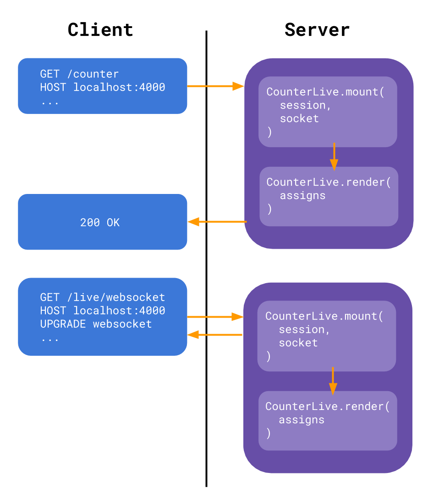

[Phoenix LiveView](https://github.com/phoenixframework/phoenix_live_view) is an exciting new way to build interactive, real-time web apps. I want to share a few example web apps I've created using LiveView and explain how these apps work.

### Motivation

Traditionally, the only way to write web apps that are highly interactive has been by using JavaScript, along with the help of a library or framework such as React, Angular, or Vue. These technologies are very powerful, and developers can use them to create complex web applciations.

For some (many?) development teams, using a modern front-end UI framework introduces a lot of complexity. At [Underbelly](https://underbelly.is), JavaScript is kind of our shtick, so the cost may not be as high as for others. Even so, I think most developers would agree that the JavaScript ecosystem can be a little crazy sometimes. It's a language that is evolving rapidly, and at the same time there's "supersets" like TypeScript, which adds types to the language. On top of that, there are tools like Babel which transpile our JavaScript into older JavaScript, or to turn our React components into actual JavaScript. In the end, these tools allow us to build sophisticated web apps, but that comes with a cost in complexity and maintainability for many development teams.

Many of the web applications that I have worked on in the past have needed only a small level of interactivity. For example, validating form input fields, or creating multi-step forms to collect user input, etc. In most cases, we ended up accomplishing these sort of requirements by adding a full-fledged front-end library like React to the codebase, and sprinkling it in where needed. In other words:

> There’s a common class of applications where rich experiences are needed, but full single-page applications are otherwise overkill to achieve the bits of required rich interaction.

Phoenix LiveView is not here to try and replace JavaScript, but it's an alternative way to create highly interactive web experiences without adding the complexity of a front-end UI library. The part of LiveView that runs in the browser uses JavaScript behind the scenes, but developers only need to write and test code using Elixir.

In summary, LiveView offers...

- Interactive, Real-Time apps without needing to write JavaScript
- A simple programming model
- Optimized application performance

### How LiveView Works

To put things simply, LiveView does what React does in terms of updating UI based on state changes, except it happens on the server. This may seem like an odd approach upon first thought, but it works suprisingly well for a lot of use cases. Let's first walk through what happens when a browser makes a request to a LiveView enabled route:

1. Client makes HTTP request to the server.
2. Server returns a plain old HTML document to the client.

At this point, the user has a full page of server-rendered content, regardless of whether the browser has JavaScript enabled/disabled.

3. Client upgrades to a websocket connection to enable real-time updates.

LiveView uses web sockets as a means of bidirectional message passing between browser and server. Once the websocket connection is established, the client may send updates to the server. Any updates to the state of the LiveView will trigger a UI render from the server, triggered by events that travel along the web socket connection. Updates don't only have to come from the browser. It's possible that other processes on the server can send messages to the LiveView process, which could result in a UI update in the browser.

### Example apps

I made a small handful of demo applications to show off LiveView. I have some experience with Elixir and Phoenix, but these apps were my first tango with LiveView. I was impressed about how simple it was to get started.

TODO: links to docs about specific apps
